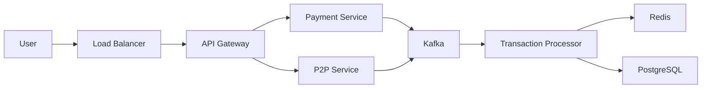

# High Level Architecture

```mermaid
flowchart LR
    User --> LB[Load Balancer]
    LB --> APIGW[API Gateway]
    APIGW --> PS[Payment Service]
    APIGW --> P2P[P2P Service]
    PS --> Kafka
    P2P --> Kafka
    Kafka --> TP[Transaction Processor]
    TP --> Redis
    TP --> PostgreSQL
```
